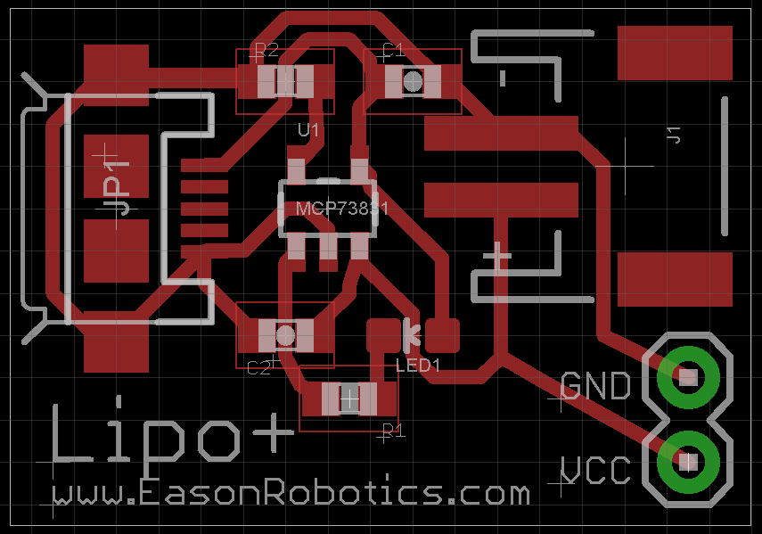
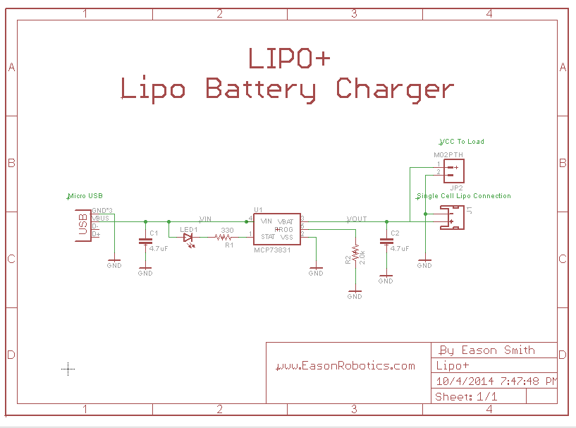

# LiPo+ Battery Charger PCB

*PCB Board Layout*

*Circuit Schematic*

A compact, single-cell LiPo battery charger PCB perfect for small electronics projects.

## Overview

LiPo+ is a battery charger PCB designed with a small form factor that can charge any single cell LiPo battery. This PCB was developed as a modular test component to validate charging functionality before integration into larger electronics projects, following a design philosophy of breaking down complex projects into smaller, testable components.

## Features

- **Universal single-cell LiPo charging** - Compatible with any single cell LiPo battery
- **Compact form factor** - Perfect for space-constrained projects
- **Mini-USB charging input** - Standard connector for easy power supply
- **Complete breakout design** with connections for:
  - Load output
  - Battery connector
  - Charging source

## Hardware Specifications

- **Charging IC**: Microchip MCP73831 LiPo Charger IC
- **Input**: Mini-USB connector
- **Battery**: Single cell LiPo (3.7V nominal)
- **Design Tool**: Cadsoft Eagle

## Design Philosophy

This PCB follows a modular design approach where complex projects are broken down into smaller, independently testable components. By validating individual subsystems like the charging circuit separately, you can:

- Reduce debugging time in final integration
- Identify issues early in the design process
- Reuse tested modules across multiple projects
- Minimize costly respins of larger, more complex PCBs

## Documentation

- **Datasheet**: [Microchip MCP73831 LiPo Charger IC](https://ww1.microchip.com/downloads/en/devicedoc/20001984g.pdf)
- **Eagle Files**: Available in this repository

## Author

Made by Eason Smith (davideasonsmith@gmail.com)
